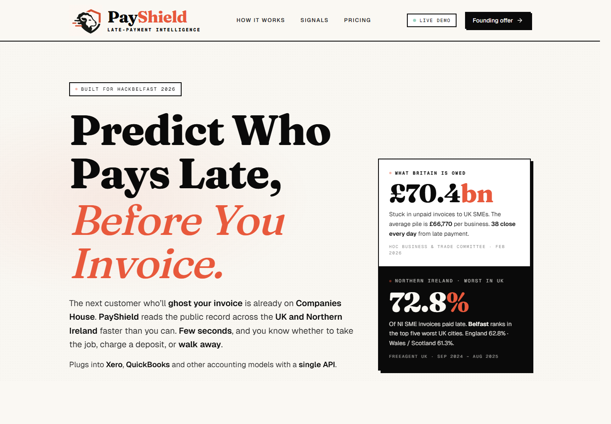
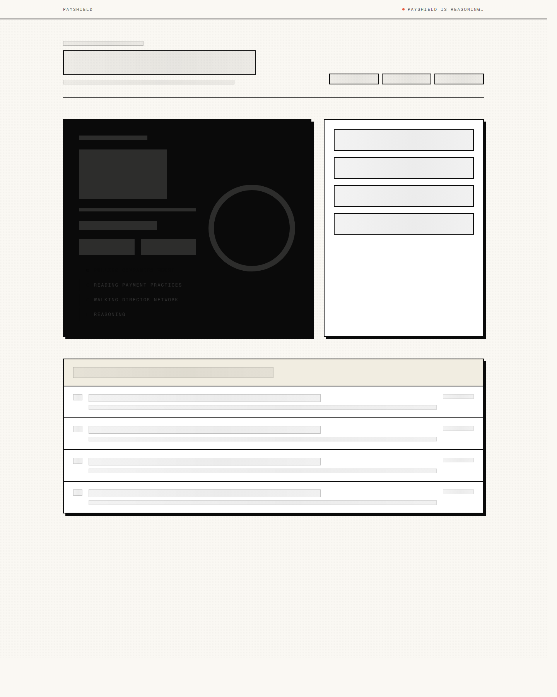
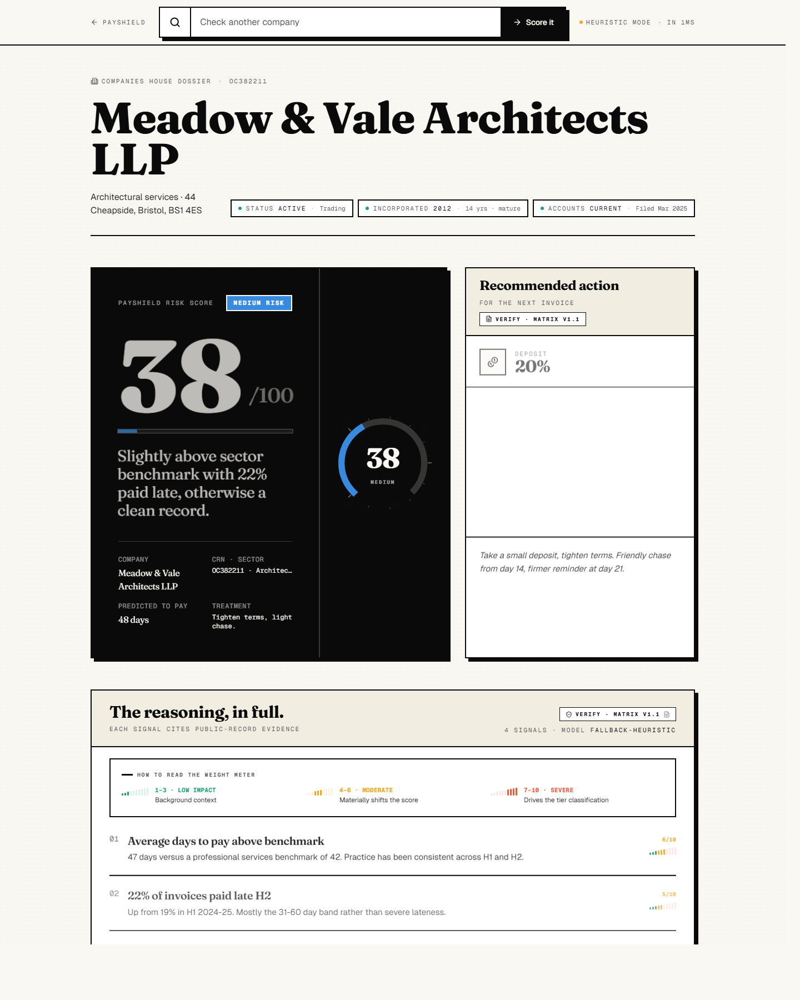

<div align="center">


# PayShield

### Predict who pays late, **before** you invoice.

A real-time payment-risk score for every UK and Northern Ireland company,
built from public Companies House and Payment Practices Reporting data —
**plain English, eight seconds, decision-ready**.

[](https://payshield-lake.vercel.app)
[](https://nextjs.org)
[](https://payshield-lake.vercel.app)
[](./LICENSE)
[](https://hackbelfast.dev)

[**→ Open the live demo**](https://payshield-lake.vercel.app)
&nbsp;·&nbsp;
[**↓ Download the Risk Matrix v1.1 PDF**](./public/payshield-risk-matrix-v1.pdf)

</div>

---

<div align="center">



</div>

---

## The problem

UK SMEs are owed **£70.4 billion** in unpaid invoices.
The average pile per business is **£66,770**.
**38 small businesses close every working day** because of late payment —
and **Belfast ranks in the top five worst UK cities**, with **72.8%** of
NI SME invoices paid late versus a UK average of 62.8%.

Existing credit tools score companies for *lending*, not for the question
a small contractor actually has at 9pm on a Tuesday: *should I take this
job, and if so, what deposit do I charge?*

PayShield answers that question in eight seconds.

---

## What it does

You type a UK or Northern Ireland customer&rsquo;s name. PayShield opens
**three public-data sources in parallel** that the rest of the market does
not connect:

1. The company&rsquo;s full **Companies House** record (status, charges,
   officers, accounts).
2. The government&rsquo;s **Payment Practices Reporting register** — every
   sizeable UK or NI buyer must publicly declare how late they pay their
   suppliers, twice a year.
3. A **two-hop walk through the director network** for shared officers,
   recent CFO exits, disqualifications, and Phoenix patterns.

It then runs that data through a **strict score-to-action decision tree**
([Risk Assessment Matrix v1.1](./public/payshield-risk-matrix-v1.pdf))
and returns:

- A **0&ndash;100 risk score** mapped to one of four named tiers.
- A **recommended action**: deposit %, contract terms, chase cadence,
  escalation day.
- A **chase email pack** ready to send (firmer reminder, escalation,
  pre-collections).
- An **on-chain payment option** alongside Stripe — 1 USDC on Solana
  Devnet via official Solana Pay.

---

## The Risk Assessment Matrix &mdash; v1.1

Every score lands in one of four tiers. Every tier triggers one specific action.

| Score | Tier | Deposit | Terms | Chase from | Escalate at | Recommended action |
|---|---|---|---|---|---|---|
| **0&ndash;29** | 🟢 LOW | No deposit | Net-30 | Day 35 | Day 60 | Invoice as standard. |
| **30&ndash;49** | 🔵 MEDIUM | 20% | Net-21 | Day 14 | Day 21 | Take a small deposit, tighten terms. |
| **50&ndash;74** | 🟡 HIGH | 40% | Net-14 | Day 7 | Day 14 | Substantial deposit, short window. |
| **75&ndash;100** | 🔴 CRITICAL | 50%+ | Net-7 | Day 3 | Day 14 | Half upfront, weekly terms, or decline the job. |

**Five weighted inputs** sum to the score:

| Signal class | Max points | What we look at |
|---|---|---|
| Payment Practices trend | **35** | H1 vs H2 worsening, late share, average days |
| Sector benchmark | **25** | Construction 67d &middot; Retail 45d &middot; Pro-services 42d |
| Director churn | **15** | Officer changes and CFO swaps in last 12m |
| Filing anomalies | **15** | Overdue accounts, dissolved-active flag |
| Network proximity | **10** | Disqualifications, charges, insolvency |
| Phoenix patterns | *Heuristic* | Forces Critical tier when triggered |

The Phoenix-pattern heuristic is the sixth signal class &mdash; a
fraud-pattern override that sits *outside* the points system. When a
recently-incorporated company shares two or more directors with a recently
insolvent mature company (overlapping SIC codes, registered office
proximity), the rule tree forces an immediate **Critical** outcome
regardless of the points score, and recommends declining the job.

---

## Live demo

| Tier | Try a real demo company |
|---|---|
| 🔴 **CRITICAL** &nbsp;(87) | [Highgate Joinery Ltd](https://payshield-lake.vercel.app/score/highgate-joinery-09887766) |
| 🔴 **CRITICAL** &nbsp;(78) | [BrightPlumb Ltd](https://payshield-lake.vercel.app/score/brightplumb-ltd-11223344) |
| 🟡 **HIGH** &nbsp;(71) | [Halford Bros (Builders) Ltd](https://payshield-lake.vercel.app/score/halford-bros-builders-08765432) |
| 🔵 **MEDIUM** &nbsp;(38) | [Meadow & Vale Architects LLP](https://payshield-lake.vercel.app/score/meadow-vale-architects-OC382211) |
| 🟢 **LOW** &nbsp;(22) | [Tesco PLC](https://payshield-lake.vercel.app/score/tesco-plc-00445790) |

Plus **7,162 real PPR-reported buyers** loaded from the published UK
Government dataset &mdash; type any name in the search box.

<div align="center">


&nbsp;


</div>

---

## Architecture

```
┌──────────────────────────────────────────────────────────────────┐
│                       Browser (Next.js App Router)               │
│  Server Components · Server Actions · Streaming UI · Suspense    │
└───────────────────────────────┬──────────────────────────────────┘
                                │
                                ▼
        ┌─────────────────────────────────────────────┐
        │  /api/companies/search  ·  /score/[id]      │
        │  Edge-compatible Functions (Node runtime)   │
        └─────────────────────────────────────────────┘
                                │
              ┌─────────────────┼─────────────────┐
              ▼                 ▼                 ▼
  ┌───────────────────┐ ┌──────────────┐ ┌──────────────────┐
  │ Companies House   │ │ UK PPR CSV   │ │ Anthropic Claude │
  │ live profile      │ │ (7,162 rows  │ │ (tool-use mode)  │
  │ (status, charges, │ │  ingested)   │ │ → submit_score   │
  │  officers, accts) │ │              │ │   _card tool     │
  └───────────────────┘ └──────────────┘ └──────────────────┘
                                │
                                ▼
              ┌─────────────────────────────────┐
              │  Score-to-action decision tree  │
              │  (Risk Matrix v1.1, strict)     │
              │                                 │
              │  + Phoenix heuristic override   │
              └─────────────────────────────────┘
                                │
                                ▼
                  ┌──────────────────────────┐
                  │  ScoreCard JSON          │
                  │  → tier, deposit_pct,    │
                  │    terms_days, chase_*,  │
                  │    reasoning[], action   │
                  └──────────────────────────┘
```

When `ANTHROPIC_API_KEY` is present, the LLM scoring agent runs in
tool-use mode and calls the `submit_score_card` tool with a strictly
typed payload. When the key is absent (or the agent fails), the
`fallbackScore` heuristic produces an equivalent score deterministically
from the same inputs &mdash; same tier thresholds, same action numbers,
same Phoenix override.

---

## Tech stack

| Layer | Choice | Why |
|---|---|---|
| **Framework** | Next.js 16 (App Router, Turbopack) | Server Components, streaming, type-safe |
| **Language** | TypeScript (strict) | Schema-first scoring, zero runtime guesswork |
| **Validation** | Zod | Score-card output is parsed before render |
| **AI** | Anthropic SDK &middot; Claude Sonnet 4.5 | Tool-use mode for structured scoring |
| **Styling** | Tailwind CSS v4 | Brutalist editorial design system |
| **Type display** | Fraunces (serif) + Geist (sans + mono) | Display weight + functional clarity |
| **Animation** | Pure CSS keyframes | Score-pop, type-in, risk-fill, pulse-dot |
| **Data ingest** | Papaparse | Streaming 97 MB UK PPR CSV at build time |
| **Payment (card)** | Stripe Payment Links | No-code checkout, ready in seconds |
| **Payment (crypto)** | Solana Pay (Devnet, USDC) | On-chain alternative with QR + deep-link |
| **Hosting** | Vercel | Production deployment with preview URLs |

---

## Quick start

> Requires Node 20+, [pnpm](https://pnpm.io) 9+ (or npm), and optionally an
> `ANTHROPIC_API_KEY` for the LLM scoring path. Without a key, the fallback
> heuristic produces matrix-equivalent output.

```bash
# 1. Clone
git clone https://github.com/amiradnanptcl-hue/PayShield.git
cd PayShield

# 2. Install
pnpm install

# 3. (Optional) configure the LLM scoring path
echo "ANTHROPIC_API_KEY=sk-ant-..." > .env.local

# 4. Run dev
pnpm dev

# 5. Build for production
pnpm build && pnpm start
```

The app runs at `http://localhost:3000`. Every demo route works without
any environment variables &mdash; PPR ingest happens at build time.

### Useful commands

```bash
pnpm build         # Next production build (with TypeScript check)
pnpm start         # Run the production build locally
pnpm typecheck     # Standalone TypeScript check
pnpm lint          # Lint the codebase
```

---

## Project structure

```
payshield/
├─ app/                          # Next.js App Router
│  ├─ layout.tsx                 # Root layout, fonts, html lang
│  ├─ page.tsx                   # Landing + signal grid + pricing
│  ├─ globals.css                # Tokens, brutalist helpers, animations
│  ├─ api/companies/search/      # Search API route
│  ├─ score/[id]/                # Per-company score detail
│  └─ opengraph-image/           # Auto-generated OG image
│
├─ components/                   # Composable UI
│  ├─ score-card.tsx             # Hero + dial + reasoning + WeightLegend
│  ├─ action-brief.tsx           # Recommended action panel
│  ├─ chase-preview.tsx          # Generated chase email pack
│  ├─ search-box.tsx             # Autocomplete search w/ tier dots
│  ├─ score-meter.tsx            # Tier-coloured progress bar
│  └─ solana-pay-card.tsx        # Solana Pay QR + Phantom flow
│
├─ lib/
│  ├─ scoring/
│  │  ├─ schema.ts               # Zod input/output schemas + tierFor()
│  │  ├─ agent.ts                # Anthropic tool-use scoring agent
│  │  ├─ fallback.ts             # Heuristic scorer (matrix-equivalent)
│  │  └─ prompt.ts               # Verbatim §6.2 system prompt
│  ├─ chase/schedule.ts          # Builds the email pack from a ScoreCard
│  ├─ data/lookup.ts             # Demo + PPR resolver
│  ├─ data/ppr.ts                # 7,162-company in-memory index
│  └─ demo/companies.ts          # 5 hand-crafted demo cards
│
├─ public/
│  ├─ payshield-logo.png         # Brand mark (1388 × 470)
│  ├─ payshield-risk-matrix-v1.pdf  # Canonical methodology doc (v1.1)
│  └─ solana-logo.jpg            # Solana brand mark
│
├─ docs/screenshots/             # README assets
├─ next.config.ts                # Image qualities, Turbopack root
├─ tailwind.config.ts            # Theme tokens via @theme inline
└─ package.json
```

---

## Data sources

| Source | Coverage | Refresh | Notes |
|---|---|---|---|
| **Companies House** &mdash; UK | 5M+ active companies | Live | Profile, charges, officers, accounts |
| **UK PPR Register** | 7,162 reporting buyers | Twice yearly | Average days to pay, late share, distribution buckets |
| **Northern Ireland filings** | All NI SME data | Twice yearly | Same PPR feed, jurisdiction-tagged |

The 97 MB PPR CSV (`2026-04-25-1118-prompt-payments.csv`) is ingested at
build time into a typed in-memory index, so search and rendering are both
sub-100ms with no database round-trip.

---

## Verifiability &mdash; the matrix is auditable

Every score-to-action mapping rendered on the site is defined by a single
canonical document: the
[**PayShield Risk Assessment Matrix v1.1**](./public/payshield-risk-matrix-v1.pdf)
(also linked from a `Verify · Matrix v1.1` chip in the UI). An accountant
or auditor reviewing a score can:

1. Read the **score** and **tier** in the hero card.
2. Read the **deposit, terms, chase day, escalation day** in the action
   panel.
3. Click `Verify · Matrix v1.1` to download the PDF.
4. Confirm by hand that the displayed action exactly matches the row of
   the matrix that corresponds to the tier.

Same rules in the LLM agent prompt, the fallback heuristic, the demo
cards, the Phoenix override &mdash; one source of truth, four enforcement
points.

---

## Roadmap

- [ ] Wire live Companies House API (currently uses cached snapshots)
- [ ] Sector-benchmark refinement from full Coface UK 2026 dataset
- [ ] Slack + Microsoft Teams alerts when a watched customer&rsquo;s score
      crosses a tier boundary
- [ ] Bulk CSV upload for accountancy practices
- [ ] Direct Xero / QuickBooks invoice creation with the recommended terms
      pre-filled
- [ ] Mobile push reminders for the chase cadence

---

## Acknowledgments

Built at **HackBelfast 2026** under a 16-hour build window.

- UK Federation of Small Businesses 2025 late-payment data
- Coface UK sector benchmarks
- HoC Business & Trade Committee, *Late payment in UK SMEs*, Feb 2026
- FreeAgent UK *State of NI Late Payment*, Sep 2024 &ndash; Aug 2025
- Companies House public datasets
- UK Government Payment Practices Reporting register

---

## License

MIT &copy; 2026 Syed Aamir Adnan &mdash; see [LICENSE](./LICENSE).

---

<div align="center">

**[ Live demo &rarr; ](https://payshield-lake.vercel.app)**

*Built for British and Northern Irish small businesses who deserve to be paid on time.*

</div>
